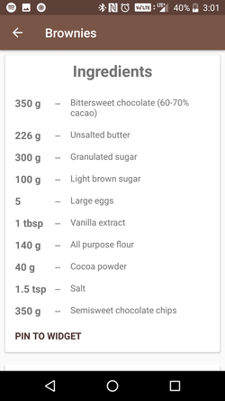

# BakeIt

BakeIt is an android application which provides different recipes to the user.
The recipes provide the ingredients and step by step video instructions for each recipe.

  

  
Recipes contain detailed steps with video or photo instructions. The application
makes use of the Exoplayer library to display videos within the application.
  

  
Video or image switches to full screen on orientation change

BakeIt provides multi pane support and dynamic layouts for tablet devices.
The application dynamically scales itself to fill tablet devices

# To run BakeIt

1. Clone the project
2. Import the project into Android Studio as an existing android application

